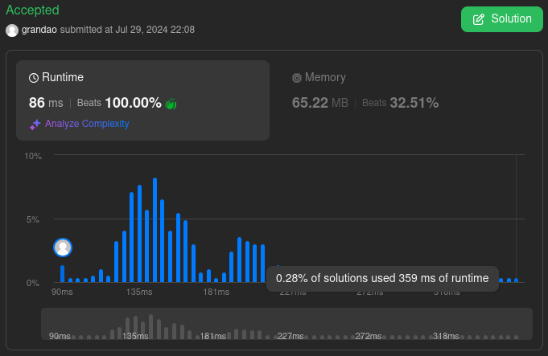

# Greed LeetCode
**Conteúdo da Disciplina**: Greed 

## Alunos
|Matrícula | Aluno |
| -- | -- |
| 21/1039250  |  Arthur Grandão de Mello |
| 21/10295440  |  Pedro Sena Barbosa Holtz Yen |

## Sobre 
Este projeto consiste na resolução de questões de Juiz Eletrônico Online

## Instalação 
**Linguagem**: Python e C++ 
**Framework**: Nenhum 
Ter o python e o c++ instalados.

## Uso 
Você deve submeter os códigos nos sites ou criar casos de teste localmente.

## Exercícios e prints 

[452. Minimum Number of Arrows to Burst Balloons](https://leetcode.com/problems/minimum-number-of-arrows-to-burst-balloons/description/)

[135. Candy](https://leetcode.com/problems/candy/description/)

[(AtCoder) Destroyer Takahashi](https://atcoder.jp/contests/abc230/tasks/abc230_d)

[2931. Maximum Spending After Buying Items](https://leetcode.com/problems/maximum-spending-after-buying-items/description/)

